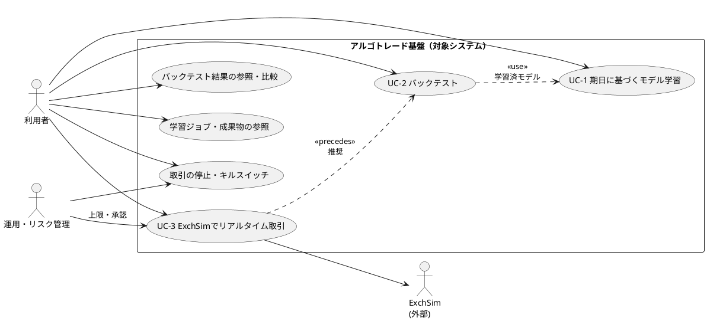

# ユースケース図（PRD ベース）

**UC ID の表記:** メイン UC は `UC-1` … のように **ハイフン付き**。派生（参照・結果閲覧・停止などのサブフロー）は **`r` / `s` 接尾辞**（例: `UC-1r`, `UC-2r`, `UC3s`）。接尾辞だけを付けた短縮形（`UC3s`）が図に出る場合は、対応する `UC-3` 系のサブユースケースを意味する。

本書は [01_business-requirements.md](01_business-requirements.md) のユースケース概要・ステークホルダーを反映した **ビジネスレベル** のユースケース図である。実装クラスや API 名は含めない。

---

## 1. 図（Mermaid）

Mermaid を表示できない環境では、後述の **PlantUML** または **一覧表** を参照する。

```mermaid
usecaseDiagram
  left to right direction

  actor "利用者" as User
  actor "運用・リスク管理" as Ops
  actor "ExchSim\n(外部システム)" as Exch

  usecase "UC-1 期日に基づく\nモデル学習" as UC1
  usecase "学習ジョブ・成果物の参照" as UC1r
  usecase "UC-2 バックテスト" as UC2
  usecase "バックテスト結果の\n参照・比較" as UC2r
  usecase "UC-3 ExchSimで\nリアルタイム取引" as UC3
  usecase "取引の停止・\nキルスイッチ" as UC3s

  User --> UC1
  User --> UC1r
  User --> UC2
  User --> UC2r
  User --> UC3
  User --> UC3s

  Ops --> UC3
  Ops --> UC3s

  UC3 --> Exch

  UC2 ..> UC1 : 学習済モデル利用
  UC3 ..> UC2 : 評価後移行（推奨）
```


### 関係の読み方


| 関係           | 意味                                                      |
| ------------ | ------------------------------------------------------- |
| 実線（利用者 → UC） | 当該アクターがそのユースケースに関与する（主に実行・参照）。                          |
| `..>`        | ユースケース間の**依存・典型的な前後関係**（必須の技術的 include ではなく、運用上の推奨を表す）。 |
| `UC3 → Exch` | リアルタイム取引が ExchSim API と相互作用する。                          |


---

## 2. 代替: PlantUML

PlantUML 対応エディタ・CI でレンダリングする場合は以下を使える。



※ `<<use>>` / `<<precedes>>` は厳密な UML 標準ではなく、**ビジネス上の流れ**を示すためのステレオタイプとして付与している。正式な `<<include>>` / `<<extend>>` に落とし込む場合は詳細設計フェーズで見直す。

---

## 3. アクター一覧（PRD 対応）


| アクター     | PRD 上の位置づけ      | 主な関与 UC                              |
| -------- | --------------- | ------------------------------------ |
| 利用者      | トレーダー／クオンツ／運用担当 | UC-1, UC-1r, UC-2, UC-2r, UC-3, UC3s |
| 運用・リスク管理 | 上限・承認・監査        | UC-3, UC3s（組織により必須化可）                |
| ExchSim  | 外部システム          | UC-3（API 連携）                         |


---

## 4. ユースケース一覧（図中の ID と PRD の対応）


| 図中 ID | PRD の UC                | 備考                      |
| ----- | ----------------------- | ----------------------- |
| UC-1  | UC-1 期日を指定したモデル学習       | 学習実行                    |
| UC-1r | （PRDの BR から派生）          | 状態・メタデータ参照を明示化          |
| UC-2  | UC-2 バックテスト             |                         |
| UC-2r | FR-04 比較に相当             | PoC では「参照・比較」をサブ UC に分割 |
| UC-3  | UC-3 ExchSim でのリアルタイム取引 |                         |
| UC3s  | BR-UC3-03 停止、NFR キルスイッチ | 利用者・運用の双方から関与し得る        |


---

## 5. スコープ外（PRD）との関係

以下は **ユースケース図に含めない**（別要求・別図が望ましい）。

- 実取引所・実資金の入出金
- オンライン学習（マーケット中の連続学習）
- 課金・請求

---

## 関連ドキュメント

- 各 UC の **シーケンス図（時系列）**: [03_sequence_diagram.md](03_sequence_diagram.md)

## 改訂


| 版   | 内容            |
| --- | ------------- |
| 0.1 | PRD 草案に基づく初版  |
| 0.2 | シーケンス図へのリンク追加 |


