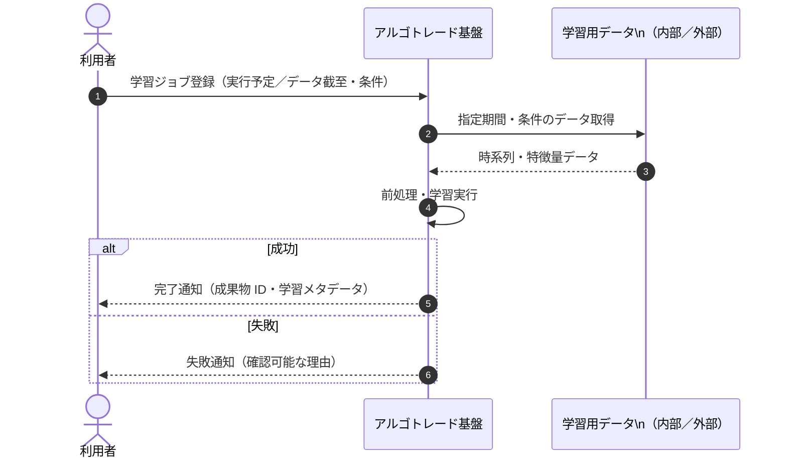
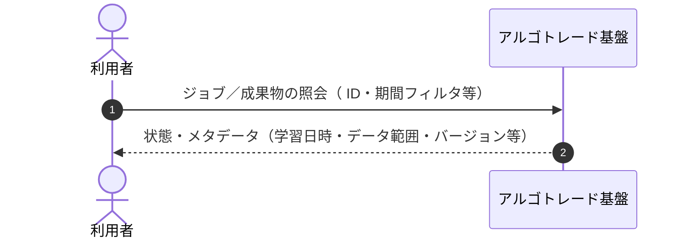
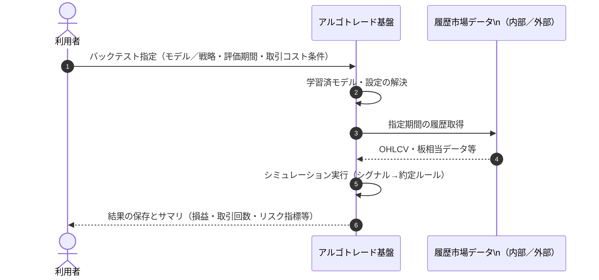
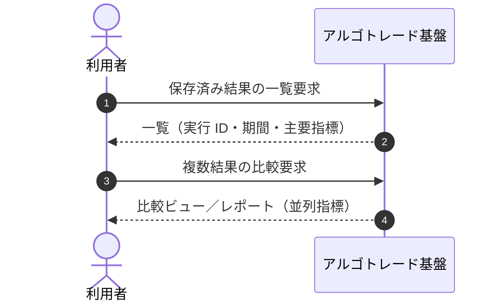
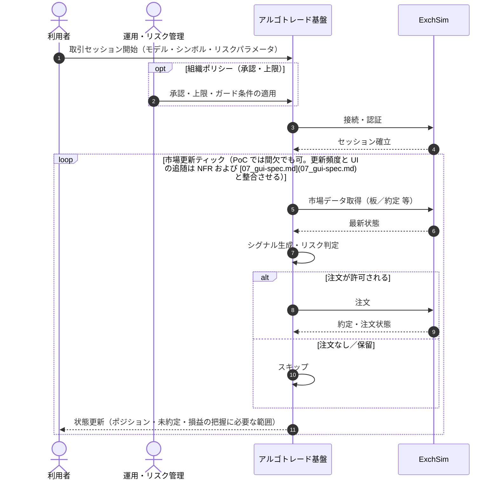
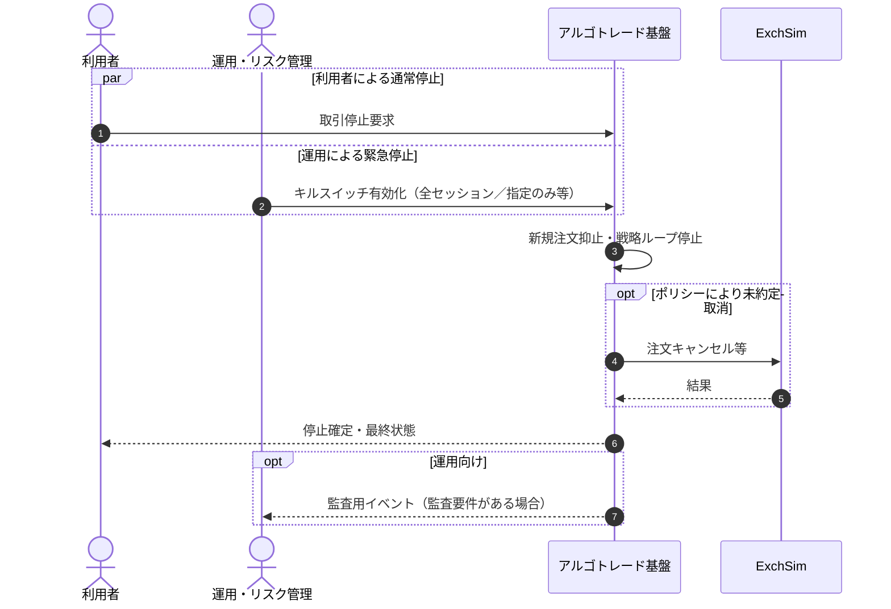
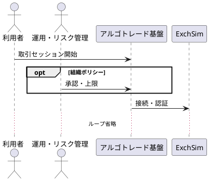

# シーケンス図（ユースケース図ベース）

本書は [02_use-case-diagram.md](02_use-case-diagram.md) のアクター・ユースケースを、**時系列の相互作用**として表現したものである。  
**対象システム**は論理ブロックとして「アルゴトレード基盤」と総称する（内部モジュール名は含めない）。  
**静的な境界（C4 L1/L2）** とユースケースの対応は [04_c4-level1-system-context.md](04_c4-level1-system-context.md) / [05_c4-level2-containers.md](05_c4-level2-containers.md) を参照。

---

## 図の対応関係

| 節 | 対応 UC | 概要 |
|----|---------|------|
| [§1](#1-uc-1-期日に基づくモデル学習) | UC-1 | 学習ジョブの登録から成果物保存まで |
| [§2](#2-uc-1r-学習ジョブ成果物の参照) | UC-1r | 状態・メタデータの参照 |
| [§3](#3-uc-2-バックテスト) | UC-2 | モデル＋期間・条件での評価 |
| [§4](#4-uc-2r-バックテスト結果の参照比較) | UC-2r | 結果一覧・比較 |
| [§5](#5-uc-3-exchsim-でのリアルタイム取引) | UC-3 | ExchSim との継続的相互作用 |
| [§6](#6-uc3s-取引の停止キルスイッチ) | UC3s | 利用者／運用による停止 |
| [§7](#7-c4-静的図への参照) | UC 全体 | C4 レベル1・2の**静的**表現は別紙（トレーサビリティ表付き） |

---

## 1. UC-1 期日に基づくモデル学習

---

## 2. UC-1r 学習ジョブ・成果物の参照

---

## 3. UC-2 バックテスト

> UC-2 はユースケース図上 UC-1 に依存（学習済モデルの利用）。上記では「モデル解決」に集約して表現している。

---

## 4. UC-2r バックテスト結果の参照・比較

[§3](#3-uc-2-バックテスト) の実行結果は基盤内に保存され、本節では **利用者とアルゴトレード基盤のみ** を対象とする（[04_c4-level1-system-context.md](04_c4-level1-system-context.md) の UC-2r 行とも対応）。

---

## 5. UC-3 ExchSim でのリアルタイム取引

> UC-3 はユースケース図上 UC-2 への依存が「推奨」。上記では省略可能だが、運用ではバックテスト合格モデルのみ選択する想定を注記する。

---

## 6. UC3s 取引の停止・キルスイッチ

---

## 7. C4 静的図への参照

[C4 モデル](https://c4model.com/) の **レベル1（システムコンテキスト）** と **レベル2（コンテナ）** は、**静的な境界図**で表すのが標準である。  
時系列の相互作用は **本書 §1〜§6** のシーケンス図を正とし、静的な「誰が・どのシステムと・どの境界でつながるか」は次の別紙に記載する（いずれも **ユースケースとのトレーサビリティ表** 付き）。

| レベル | ファイル | 内容 |
|--------|----------|------|
| L1 | [04_c4-level1-system-context.md](04_c4-level1-system-context.md) | 利用者・運用・アルゴトレード基盤・データ基盤・ExchSim |
| L2 | [05_c4-level2-containers.md](05_c4-level2-containers.md) | Web UI / BFF / 取引ランタイム / アダプタ / 学習・分析ワーカー と外部 |

---

## PlantUML（参考）

Mermaid が使えない場合の代替として、同内容を PlantUML で表す例を示す（§5 のみ抜粋）。

---

## 改訂

| 版 | 内容 |
|----|------|
| 0.1 | ユースケース図に基づく初版 |
| 0.2 | §7 C4 レベル1・2境界に相当するシーケンス図を追加 |
| 0.3 | §7 を静的 C4 図（L1/L2）の別紙参照に変更 |
