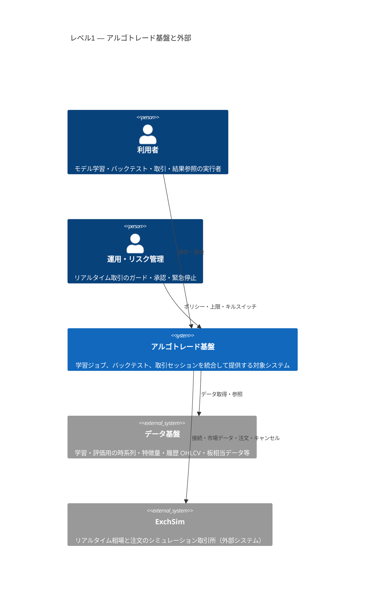

# C4 レベル1 — システムコンテキスト（静的）

本書は [02_use-case-diagram.md](02_use-case-diagram.md) および [03_sequence_diagram.md](03_sequence_diagram.md) のユースケースを、**C4 モデルのレベル1（システムコンテキスト）**として静的に表現する。  
時系列の相互作用は [03_sequence_diagram.md](03_sequence_diagram.md) の各節（シーケンス図）を参照する。

---

## 1. コンテキスト図（Mermaid C4Context）

> Mermaid の C4 記法が使えないビューアの場合は、[02_use-case-diagram.md](02_use-case-diagram.md) のユースケース図と下表を併用する。

---

## 2. ユースケースとのトレーサビリティ（L1）

「図上の関係」は `Rel` の向きとノードの組み合わせで読む。本文の UC 名は [02_use-case-diagram.md](02_use-case-diagram.md) に準拠する。

| UC | 主アクター | 関与する外部システム | 図上の経路（要約） |
|----|------------|----------------------|---------------------|
| **UC-1** 期日に基づくモデル学習 | 利用者 | データ基盤 | `利用者 → アルゴトレード基盤 → データ基盤` |
| **UC-1r** 学習ジョブ・成果物の参照 | 利用者 | （成果は基盤内、データ出所はデータ基盤） | `利用者 → アルゴトレード基盤`（参照）。学習時のデータ前提は `基盤 → データ基盤` |
| **UC-2** バックテスト | 利用者 | データ基盤 | `利用者 → アルゴトレード基盤 → データ基盤` |
| **UC-2r** バックテスト結果の参照・比較 | 利用者 | （一覧・比較の主データは **基盤内の保存結果**。指標の再計算や外部参照が要る場合のみデータ基盤） | 主経路は `利用者 → アルゴトレード基盤` のみ。[03_sequence_diagram.md](03_sequence_diagram.md) §4（保存済み結果の照会・比較）はデータ基盤を participant に含めない。 |
| **UC-3** ExchSim でのリアルタイム取引 | 利用者、運用・リスク管理 | ExchSim | `利用者 → 基盤 → ExchSim`、併せて `運用 → 基盤`（承認・上限） |
| **UC3s** 取引の停止・キルスイッチ | 利用者、運用・リスク管理 | ExchSim（取消し等のポリシー時） | `利用者|運用 → 基盤`。未約定取消等は `基盤 → ExchSim` |

### 2.1 トレースの読み方

- **L1 では「アルゴトレード基盤」を分解しない**。同一の `アルゴトレード基盤` ノードが UC-1〜UC3s のすべてに現れる。
- **外部との境界**だけが UC ごとの差になる: 学習・バックテスト系は **データ基盤**、リアルタイム取引系は **ExchSim**、運用介入は **運用 → 基盤**。

---

## 3. 関連ドキュメント

| 文書 | 用途 |
|------|------|
| [03_sequence_diagram.md](03_sequence_diagram.md) | UC ごとのシーケンス（時系列） |
| [05_c4-level2-containers.md](05_c4-level2-containers.md) | 基盤内部のコンテナ分解（静的・L2） |
| [architecture.md](architecture.md) | Rust クレート単位の論理アーキテクチャ |

---

## 改訂

| 版 | 内容 |
|----|------|
| 0.1 | L1 静的コンテキスト図と UC トレース初版 |
