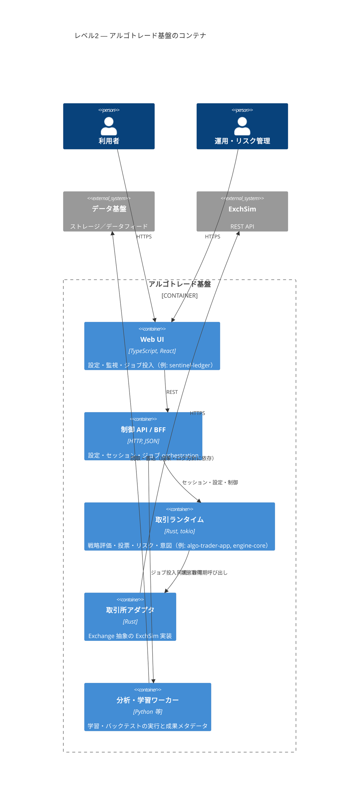

# C4 レベル2 — コンテナ図（静的）

本書は [02_use-case-diagram.md](02_use-case-diagram.md) および [03_sequence_diagram.md](03_sequence_diagram.md) のユースケースを、**C4 モデルのレベル2（コンテナ）**として静的に表現する。  
「アルゴトレード基盤」内部を **運用上の配置単位（コンテナ）** に分け、外部システムとの接続点を示す。実装は 1 コンテナ＝1 プロセスに限らない。

---

## 1. コンテナ図（Mermaid C4Container）

> **取引所アダプタ**: 論理コンテナとして独立させ、UC-3 の外部境界（ExchSim）を明示する。デプロイでは `rt` と同一バイナリに含まれてもよい。

> **分析・学習ワーカー**: [architecture.md](architecture.md) および [python-ml-snapshot-policy.md](python-ml-snapshot-policy.md) のとおり、Rust ワークスペース外のプロセス／ジョブに相当する集約表現。

**デプロイ注記:** 図上の `Web UI → 制御 API / BFF` は論理上の既定経路。シンプルな構成では BFF を省略し **Web UI（またはクライアント）から `algo-trader-control` 等へ直接** 接続してよい（[06_external-design.md](06_external-design.md) の境界図と参照整合）。

---

## 2. ユースケースとのトレーサビリティ（L2）

「主に触れるコンテナ」を **Primary**、付随的に関わるものを **Secondary** とする。

| UC | Primary コンテナ | Secondary コンテナ | 外部システム |
|----|-------------------|---------------------|--------------|
| **UC-1** | `Web UI`, `制御 API / BFF`, `分析・学習ワーカー` | — | `データ基盤` |
| **UC-1r** | `Web UI`, `制御 API / BFF`, `分析・学習ワーカー` | — | （保存済みメタは基盤側。学習時の参照元は `データ基盤`） |
| **UC-2** | `Web UI`, `制御 API / BFF`, `分析・学習ワーカー` | — | `データ基盤` |
| **UC-2r** | `Web UI`, `制御 API / BFF`, `分析・学習ワーカー` | — | （主に基盤・WK 側に保存済みの結果メタ。指標再集計でデータ基盤を触る場合のみ） |
| **UC-3** | `Web UI`, `制御 API / BFF`, `取引ランタイム`, `取引所アダプタ` | `分析・学習ワーカー`（同一画面からの付帯操作時） | `ExchSim` |
| **UC3s** | `Web UI`, `制御 API / BFF`, `取引ランタイム`, `取引所アダプタ` | — | `ExchSim`（取消し等を行う場合） |

### 2.1 図上の `Rel` と UC の対応（参照用）

| UC | 代表的な経路（コンテナ間） |
|----|---------------------------|
| UC-1 / UC-1r | `Web UI → 制御 API / BFF → 分析・学習ワーカー`（照会・登録） |
| UC-2 / UC-2r | 上に同じ。バックテスト結果参照は `BFF` 経由で `WK` の保存済み状態・成果を読む想定（一覧・比較は [03_sequence_diagram.md](03_sequence_diagram.md) §4 に準拠し、主に基盤内完結） |
| UC-3 | `Web UI → BFF → 取引ランタイム → 取引所アダプタ → ExchSim` |
| UC3s | `Web UI → BFF → 取引ランタイム`（停止・抑止）。必要に応じ `取引ランタイム → アダプタ → ExchSim` |

---

## 3. L1 との対応

| L1 のノード | L2 での展開先 |
|-------------|----------------|
| アルゴトレード基盤 | `Container_Boundary` 内の 5 コンテナ全体 |
| データ基盤 | 変更なし（外部）。主に `分析・学習ワーカー` が利用 |
| ExchSim | 変更なし（外部）。`取引所アダプタ` が利用 |

詳細は [04_c4-level1-system-context.md](04_c4-level1-system-context.md)。

---

## 4. 関連ドキュメント

| 文書 | 用途 |
|------|------|
| [03_sequence_diagram.md](03_sequence_diagram.md) | UC ごとのシーケンス（時系列） |
| [04_c4-level1-system-context.md](04_c4-level1-system-context.md) | システム境界のみの静的図 |
| [adapter-exchsim.md](adapter-exchsim.md) | ExchSim 適合の HTTP マッピング |

---

## 改訂

| 版 | 内容 |
|----|------|
| 0.1 | L2 静的コンテナ図と UC トレース初版 |
