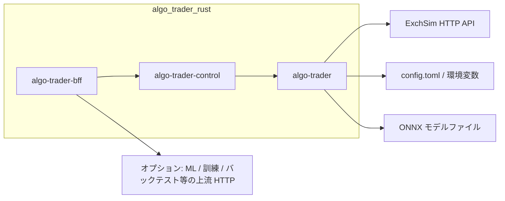

# 外部設計書（algo_trader_rust）

## 1. 目的・スコープ

| 項目 | 内容 |
|------|------|
| 対象 | Rust ワークスペース `algo_trader_rust`（ルート `Cargo.toml` の `members`） |
| 目的 | ティックごとに市場スナップショットを取得し、複数戦略の投票を集約し、リスクを通したうえで取引意図（Intent）を生成し、設定に応じて取引所 API を呼び出す |
| 範囲外（参照のみ） | `vendor/ml_pipeline_snapshot_*` は Python 設定のスナップショットであり、Rust バイナリのランタイム依存ではない |

---

## 2. システム境界（外部アクター）

- **ExchSim**: 認証、板、注文、ポジション（`adapter-exchsim` 経由）。
- **設定**: `config.toml` + `ALGO_TRADER_*`（figment による環境変数オーバーレイ）+ ExchSim 用 `EXCHSIM_USERNAME` / `EXCHSIM_PASSWORD` または JWT 等。
- **ONNX**: `strategies-predict` がワークスペース内の `ml_bridge/model.onnx` 等を読み込む（ローカルファイル）。
- **BFF**: 任意。`/v1/*` をまとめ、`algo-trader-control` および別ホストの ML・訓練・バックテスト等へプロキシする（`bff.rs` 内の各 `*_base_url`）。
  - **簡易デプロイ:** BFF を置かず、UI またはスクリプトから **control／ランタイムの HTTP を直接**叩く構成も許容する。論理アーキテクチャ（[05_c4-level2-containers.md](05_c4-level2-containers.md)）上の「UI→BFF→…」は既定のまとめ経路として扱う。
- **認証（現状 PoC）:** `algo-trader-control` は HTTP レイヤの認証を持たない。`algo-trader-bff` は `ALGO_TRADER_BFF_READ_API_KEY` / `ALGO_TRADER_BFF_WRITE_API_KEY` のいずれかが設定されている場合に API キー検証があり、**両方未設定のときは認証なし**。これは [07_gui-spec.md](07_gui-spec.md) §10 の目標との差であり、**要件を緩めるのではなく実装バックログで充足**する（[01_business-requirements.md](01_business-requirements.md) §8.1）。

---

## 3. コンポーネント（クレート）一覧

| クレート | 役割 |
|----------|------|
| **engine-core** | ドメイン中核。**設定**（`AppConfig`）、**投票**（`VoteEngine` / `VotePolicy`）、**リスク**（`RiskService` / `RiskLimits`）、**パイプライン**（`TradingPipeline`：投票→Intent）、**取引所抽象**（`Exchange` トレイトと DTO）、**実行モード**（`dry_run` / `Live`）、キルスイッチ。取引所 I/O は持たずロジック中心。 |
| **strategy-api** | 戦略プラグインの契約。**`MarketSnapshot`**（板・バー）と **`Strategy` トレイト**（`evaluate` → `StrategyVote`）のみを定義。 |
| **strategies-mm** | マーケットメイク系の実装例。 |
| **strategies-arb** | アービトラージ系の実装例。 |
| **strategies-momentum** | モメンタム系の実装例。 |
| **strategies-predict** | **ONNX**（`ort`）で推論し投票へ変換。モデル・スキーマパスは `app` が `PredictStrategyConfig` で指定。 |
| **adapter-exchsim** | **`Exchange` の ExchSim 実装**（`reqwest`）。`/api/auth/login`、板、注文、キャンセル、ポジション等。 |
| **app** | **組み立てとランタイム**。設定読み込み、戦略の束ね、`EngineRunner` によるティックループ、ExchSim アダプタ生成、`ManagedSession`（control 用）。 |

---

## 4. 実行バイナリと外部インタフェース

| バイナリ | 役割 |
|----------|------|
| **algo-trader** | **コマンドラインから起動するコンソール用バイナリ**（単一プロセスでメインループ `run_forever`）。起動方法は後述のとおり **引数処理が最小** であり、サブコマンドや `--help` などのリッチな CLI フレームワークは用いていない。 |
| **algo-trader-control** | **HTTP サーバ**。セッション開始／停止／ステータス取得。デフォルト待受 `127.0.0.1:8088`（`ALGO_TRADER_CONTROL_ADDR` で変更可）。内部で `spawn_session` を使用。 |
| **algo-trader-bff** | **HTTP BFF**。`/v1/*` を集約し、control および環境変数で指定した上流（ML・訓練・バックテスト等）へプロキシ。 |

### 4.1 `algo-trader` の起動インタフェース

- **実装**: `std::env::args()` のみ（clap / structopt 等は未使用）。
- **第1引数（任意）**: 読み込む設定ファイルのパス。省略時はカレントディレクトリの `config.toml`。
- **第2引数以降**: 未使用。
- **オプション・サブコマンド**: なし（`--help` を付けてもパスとして解釈され失敗する）。
- **その他の制御**: ログレベル等は環境変数（例: `RUST_LOG`）、設定本体は TOML + `ALGO_TRADER_*` 環境変数。

広い意味では「シェルから起動するコマンドライン向けプログラム」だが、本書では **コンソール用エントリポイント** と呼び、**CLI ツール**（複数サブコマンド・フラグ体系）とは区別する。

---

## 5. 主要データフロー（1 ティック）

1. **市場入力**: `config.exchange` あり → `Exchange::get_order_book`（ExchSim）。失敗時はフォールバックの合成スナップショット。
2. **戦略**: 各 `Strategy::evaluate` → `StrategyVote` のベクタ。
3. **集約・リスク**: `TradingPipeline::decide`（投票エンジン + `RiskService`）→ `Intent`。
4. **ポジション同期**: 設定間隔で `get_position_summary` → リスクのポジション更新（ログ例: `position sync`）。
5. **発注**: `is_live_execution()` が真のときのみ `place_order`（`dry_run` または `ExecutionMode::DryRun` では注文 API を呼ばない）。

---

## 6. ExchSim 連携（論理インタフェース）

`engine-core` の `Exchange` トレイトが想定する操作:

- 認証の確立（ログインまたは事前トークン）
- 板取得、注文、キャンセル、ポジションサマリ

実装は `adapter-exchsim` が **HTTP ベース URL**（`config.toml` の `[exchange].base_url`）に対して行う。

---

## 7. 設定の外部インタフェース

- **ファイル**: `config.toml`（`figment`: TOML + `ALGO_TRADER_` プレフィックスの環境変数）。
- **取引所認証**: `[exchange]` の `token_env` または `username_env` + `password_env` で参照する環境変数名を指定し、値は環境に置く（TOML に秘密を書かない）。

---

## 8. 観測性・運用

- **ログ**: `tracing`（`RUST_LOG` 等）。ExchSim 連携成功の目安として `position sync position=...` 等が出力される。
- **キルスイッチ**: `runtime.kill_switch_path` にファイルが存在すると新規ティックを抑制。

---

## 9. 関連ドキュメント

- 処理の時系列は [03_sequence_diagram.md](03_sequence_diagram.md) と対応させると、本書の「境界」と「クレート責務」の追跡が容易。
