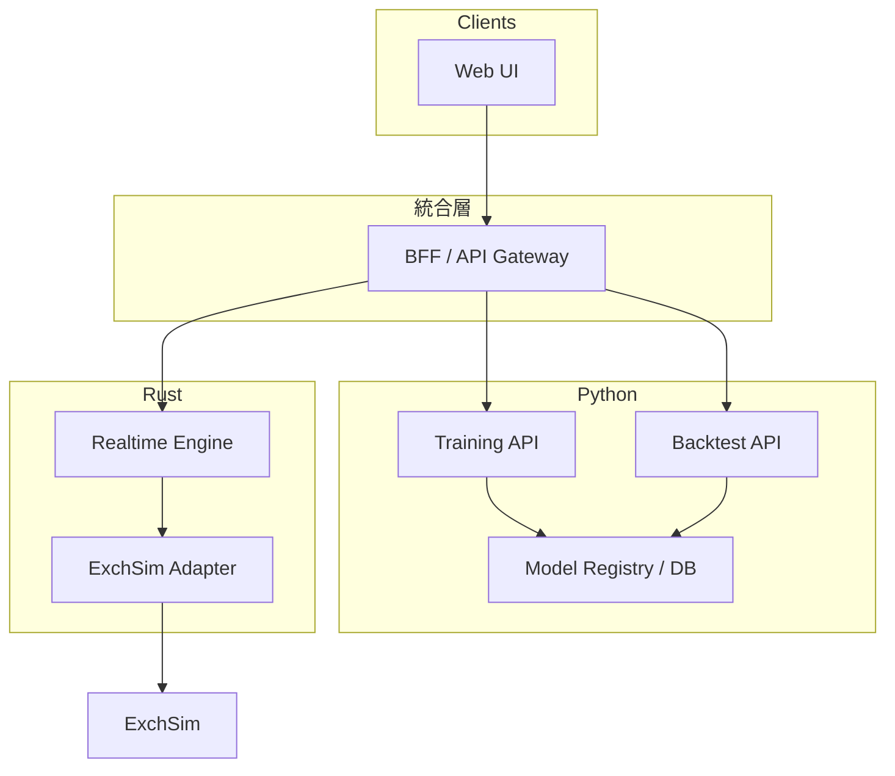

# 未充足機能 設計書

| 項目 | 内容 |
|------|------|
| 文書 ID | DESIGN-UNMET-2026-04-12 |
| 版 | 0.1 |
| 作成日 | 2026-04-12 |
| ステータス | 草案（実装前レビュー用） |
| 前提文書 | [business-requirements.md](business-requirements.md)、[backend-readiness.md](backend-readiness.md)、[sequence-diagrams.md](sequence-diagrams.md)、[python-ml-snapshot-policy.md](python-ml-snapshot-policy.md) |

---

## 1. 目的

[backend-readiness.md](backend-readiness.md) で整理した **未充足機能**について、**実装に移せる粒度**の設計（責務境界、主要コンポーネント、インタフェース案、データ・ID 方針）を定義する。  
本書は **フロントがモックから本番 UI に進む**際のバックエンド整備の指針とする。

---

## 2. 対象ギャップ（スコープ）

本設計書のスコープに含める未充足項目は次のとおり。

| ID | ギャップ | 関連 UC |
|----|----------|---------|
| G-A | **単一 API 面の欠如**（学習／バックテスト／実時間が分断） | 全体 |
| G-B | **Rust 実時間ループ**が ExchSim と未配線（板・注文・ポジション） | UC-3 |
| G-C | **Rust に HTTP なし**（フロントからジョブ・状態を直接取得できない） | UC-1r, UC-2r |
| G-D | **トレーサビリティ**（学習 ID → バックテスト → セッション）未設計 | PRD G1 |
| G-E | **キルスイッチ後の取消・クリーンアップ**が app 未実装 | UC3s |

**スコープ外（本書ではインタフェースのみ触れる程度）**

- Python `ml_pipeline` 内部の学習アルゴリズム変更。
- 実取引所接続、課金。

---

## 3. 設計原則

1. **責務の分離（推奨デフォルト）**  
   - **学習・バックテスト・モデルレジストリ**は **Python** を正とする。上流開発は **`algo_trader_v1/ml_pipeline`**、本リポ内の **固定検証**は **`vendor/ml_pipeline_snapshot_*`**（スナップショット）を用いる（詳細は [python-ml-snapshot-policy.md](python-ml-snapshot-policy.md)）。  
   - **低遅延の推論・投票・注文実行**は **`algo_trader_rust`** を正とする。

2. **単一エントリポイント**  
   - フロントは原則 **1 Base URL**（**BFF または API Gateway**）のみを認識する。  
   - BFF が Python / Rust へプロキシまたはオーケストレーションする。

3. **契約優先**  
   - 学習成果物は **`feature_schema.json` + ONNX** のバージョン付きパスで Rust に渡す（既存方針を継承）。

4. **監査可能性**  
   - すべての長時間ジョブと実時間セッションに **相関 ID**（後述）を付与する。

---

## 4. ターゲットアーキテクチャ（論理）



- **BFF** は新規コンポーネント（言語は組織標準に合わせる。PoC では **Python FastAPI 1 プロセス**で既存 API をラップする案が実装コスト低い）。

---

## 5. 機能設計

### 5.1 G-A / G-C: 統合 API（BFF）とルーティング

**目的:** モック UI が想定する操作を **REST（または将来 GraphQL）** で一括提供する。

**責務**

| ドメイン | バックエンド実体 | BFF の役割 |
|----------|------------------|------------|
| 学習ジョブの作成・状態・キャンセル | `ml_pipeline` `training_app` | パス正規化、認証ヘッダ付与、エラー形式統一 |
| バックテストジョブ | `backtest_app` | 同上 |
| モデル／成果物メタの一覧 | `ModelManager` + DB（既存） | 一覧・フィルタ API の集約 |
| **実時間セッション**の開始・停止・状態 | **Rust エンジン** | HTTP で `rt-engine` を制御（**5.2**） |

**BFF が提供する API カテゴリ（案）**

- `POST /v1/training/jobs` → Python 転送  
- `GET /v1/training/jobs/{job_id}`  
- `POST /v1/backtests` → Python 転送  
- `GET /v1/backtests/{job_id}`  
- `GET /v1/models`（メタデータ集約）  
- `POST /v1/sessions`（実時間開始）、`DELETE /v1/sessions/{id}`（停止）→ **Rust**（5.2）

**非機能**

- 認証: 組織の IdP / API Key（詳細はセキュリティ章）。
- タイムアウト: ジョブ POST は 202 Accepted + `job_id` を返し、ポーリングで状態取得（Python 既存パターンに合わせる）。

---

### 5.2 G-B: Rust 実時間エンジンと ExchSim 配線

**目的:** [sequence-diagrams.md](sequence-diagrams.md) §5 のループを実装可能にする。

**コンポーネント**

| モジュール | 変更内容 |
|------------|----------|
| `app` | `sample_snapshot` を **`Exchange::get_order_book`**（および必要なら約定履歴）に置換。設定から `ExchSimAdapter::from_token` / `from_credentials` を生成。 |
| `app` | `TradingPipeline` の `Intent::PlaceOrder` を、`dry_run == false` かつリスク OK 時に **`place_order`** へマッピング。 |
| `engine-core` または `adapter-exchsim` | **ポジションサマリー**取得を `Exchange` に追加するか、アダプタにメソッド追加（Java `getPositionSummary` 相当）。 |
| `RiskService` | 実ポジションを **定期的に同期**した値で `set_position` / `set_daily_pnl` を更新（ExchSim または内部集計）。 |

**設定拡張（例）**

```toml
[exchange]
base_url = "https://..."
auth = "env:EXCHSIM_JWT_TOKEN"  # または username/password

[runtime]
# 既存に加え
sync_position_interval_ms = 5000
```

**シーケンス（要点）**

1. ティックごとに板取得 → `MarketSnapshot` 構築。  
2. 戦略投票 → パイプライン → `Intent`。  
3. `live` かつ `PlaceOrder` → `NewOrderRequest` 変換 → `place_order`。  
4. 別タスクまたは同一ループ後段でポジション取得 → リスク更新。

---

### 5.3 G-B 補足: Rust 制御 HTTP（セッション API）

**目的:** BFF から「実時間の開始／停止」を HTTP で叩けるようにする。

**案 A（推奨 PoC）:** `algo-trader-app` と別バイナリ **`algo-trader-control`**（axum）を追加し、以下のみ実装。

- `POST /sessions` — ボディに `config` 参照またはインライン TOML サブセット、エンジンを `tokio::spawn` で起動、`session_id` を返す。  
- `DELETE /sessions/{id}` — ループ停止、オプションで未約定取消。  
- `GET /sessions/{id}/status` — 実行中／停止、最終 Intent サマリ。

**案 B:** 単一プロセスで axum を `main` に統合し、`/sessions` と内部ループを同一プロセスで管理。

**セキュリティ:** この API は **localhost のみ**または **mTLS** を必須とする（誤発注防止）。

---

### 5.4 G-D: トレーサビリティ ID と監査ログ

**目的:** PRD G1「いつ・何を対象にしたか」を横断追跡する。

**識別子（案）**

| ID | 発行元 | 例 | 用途 |
|----|--------|-----|------|
| `model_artifact_id` | Python 学習完了時 | `ma_20260412_a1b2` | ONNX + schema のバンドル |
| `backtest_run_id` | Python バックテスト完了時 | `bt_...` | 結果レポートと紐づく |
| `session_id` | Rust セッション開始時 | `sess_...` | 実時間取引ログ |
| `correlation_id` | BFF が受信時 | UUID | リクエストログ横断 |

**保存先**

- **短期:** 構造化ログ（JSON）に全 ID を出力。  
- **中期:** PostgreSQL 等に `session` テーブル（`model_artifact_id`, `backtest_run_id` 任意外部キー）。

**Rust ログに必須フィールド（案）**

- `policy_version`, `session_id`, `model_artifact_id`, `symbol`, `intent`, `order_id?`

---

### 5.5 G-E: キルスイッチ拡張（UC3s）

**現状:** ファイル存在で **新規ティックのみスキップ**。

**追加設計**

1. **ソフト停止:** 既存どおりファイルフラグ。  
2. **ハード停止:** 停止指示時に  
   - 戦略ループの `interval` を無限待ちにする、または  
   - `session` を終了状態に遷移。  
3. **未約定取消（任意ポリシー）:** `Exchange::cancel_order` を、未約定リスト取得（ExchSim の `getAllOrders` 相当をアダプタに追加）後にバッチ実行。  
4. **運用 API:** BFF 経由 `POST /v1/sessions/{id}/kill` が Rust 制御 API を呼ぶ。

---

### 5.6 UC-1r / UC-2r: 参照・比較 API

**方針:** **BFF が Python の既存／軽微拡張 API を集約**する。

**比較機能（最小）**

- クエリ: `?model_artifact_ids=a,b,c&period=2025-01-01..2025-06-01`  
- レスポンス: 各 ID のバックテスト主要指標の並列表（Python 側で集計 or BFF で複数 GET を合成）。

**Rust には実装しない**（重複を避ける）。

---

## 6. データモデル（論理）

### 6.1 ModelArtifact（Python 主）

| 属性 | 型 | 説明 |
|------|-----|------|
| id | string | `model_artifact_id` |
| created_at | datetime | |
| data_range_start / end | date | 学習データ範囲 |
| onnx_uri | string | ストレージパスまたは URL |
| schema_uri | string | `feature_schema.json` |
| metrics | json | 学習時メトリクス |

### 6.2 TradingSession（Rust 主、BFF が投影）

| 属性 | 型 | 説明 |
|------|-----|------|
| id | string | `session_id` |
| model_artifact_id | string? | 紐づけ |
| symbol | string | |
| status | enum | running, stopping, stopped, error |
| started_at / ended_at | datetime | |

---

## 7. セキュリティ・運用

- **秘密情報:** ExchSim JWT／パスワードは **環境変数またはシークレットストア**。BFF と Rust で二重管理しない（実行時注入）。  
- **ネットワーク:** Rust 制御 API は VPC 内／localhost のみ推奨。  
- **承認:** PRD の「運用・リスク管理」承認フローは、BFF でロールチェック（将来）。

---

## 8. マイルストーン（提案）

| フェーズ | 内容 | 充足するギャップ |
|----------|------|------------------|
| M1 | BFF プロトタイプ + Python プロキシ + モデル一覧 | G-A, G-C（部分） |
| M2 | Rust 板取得 + 実注文 + ポジション同期 | G-B |
| M3 | Rust HTTP セッション API + BFF 連携 | G-A, G-C, G-B |
| M4 | ID 付与 + 構造化ログ + DB（任意） | G-D |
| M5 | キルスイッチ + 取消 | G-E |

---

## 9. リスク

| リスク | 緩和 |
|--------|------|
| Python と Rust の二重メンテ | BFF で API を一本化し、ドキュメント単一ソース化 |
| ExchSim API と Java 実装の差分 | `adapter-exchsim` の結合テストを ExchSim 実機 or 記録レスポンスで実施 |
| セッション API の誤発注 | localhost 制限 + 二段階確認 API |

---

## 10. 参照

- [backend-readiness.md](backend-readiness.md)
- [business-requirements.md](business-requirements.md)
- [sequence-diagrams.md](sequence-diagrams.md)

---

## 改訂履歴

| 版 | 日付 | 内容 |
|----|------|------|
| 0.1 | 2026-04-12 | 初版 |
| 0.2 | 2026-04-12 | Python スナップショット方針を前提文書・設計原則に反映 |
