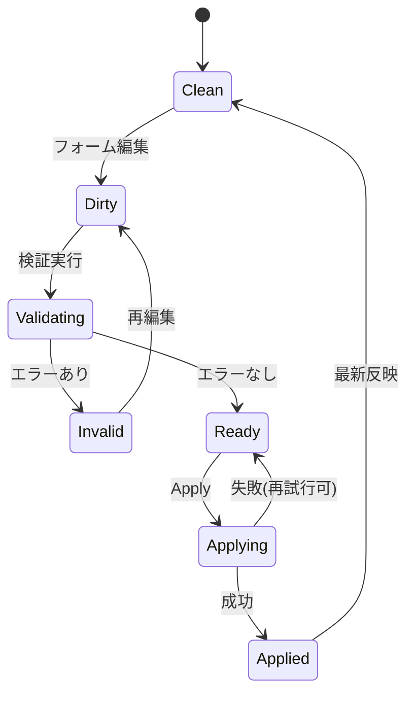

# GUI設計書（部品・動作網羅、デザイン非依存）

本書は `spec/user-stories-and-sequences.md` のストーリーを実現するために必要な GUI の要件定義です。  
見た目（配色、余白、タイポ）は対象外とし、**必要部品・状態・操作・イベント・権限・エラー挙動**を定義します。

---

## 1. 目的とスコープ

### 1.1 目的

- 運用者/戦略開発者/リスク管理者が、CLI や設定ファイル編集に依存せずに運用できること
- `dry_run` 検証から `live` 運用（将来拡張）まで同一 UI で段階的に扱えること
- 意思決定過程（vote -> outcome -> intent -> risk）を追跡できること

### 1.2 スコープ

- **MVP対象（現行実装に近い）**: ストーリー 1〜4
- **Phase2対象（拡張）**: ストーリー 5〜6
- 本 GUI は Web UI を想定（デスクトップ化しても要件は同一）

---

## 2. ユーザーロールと権限

| ロール | 主目的 | 参照 | 更新 | 実行系操作 |
|---|---|---|---|---|
| 運用者 (Operator) | 稼働監視、設定反映、キルスイッチ | 全画面 | Runtime/Policy/Risk 更新 | キルスイッチON/OFF、設定反映 |
| 戦略開発者 (Strategy Dev) | dry_run 検証、票の分析 | 監視、投票詳細、ログ | 一部（投票重み/閾値） | dry_run 実行確認 |
| リスク管理者 (Risk Manager) | リスク制約管理 | リスク/注文審査 | RiskLimits 更新、日次損失値更新 | ブロック理由レビュー |
| トレーダー (Trader, Phase2) | live 注文実行状況確認 | 注文/接続状況 | （必要に応じ）実行モード | 注文送信許可状態確認 |
| データ連携担当 (Integrator, Phase2) | データソース切替監視 | データ連携画面 | 接続先設定 | 取得状態確認 |

権限モデルは最小でも `viewer` / `operator` / `admin` の 3 段階を推奨する。

---

## 3. 画面構成（情報アーキテクチャ）

- `Dashboard`（稼働概要）
- `Strategy & Vote Monitor`（戦略票・合意結果）
- `Risk Control`（リスク閾値とブロック状況）
- `Runtime Control`（dry/live、tick、キルスイッチ）
- `Config Editor`（policy/risk/runtime の編集と適用）
- `Audit Log`（変更履歴・実行履歴）
- `Orders`（Phase2: 注文ライフサイクル）
- `Data Sources`（Phase2: 板/バー取得状況）

---

## 4. 画面別詳細要件

## 4.1 Dashboard

### 表示部品

- システムステータスカード
  - エンジン稼働状態（Running/Stopped/Degraded）
  - 現在モード（dry_run/live）
  - キルスイッチ状態（Active/Inactive）
- 主要KPIカード
  - ティック処理数（直近1分/5分）
  - `NoTrade` / `PlaceOrder` 件数
  - リスクブロック件数（理由別）
- 最新判断タイムライン（最新 N 件）
  - timestamp, symbol, vote outcome, final intent, risk decision
- アラート一覧
  - リスク閾値超過、設定適用失敗、接続異常

### 操作

- アラート詳細の展開
- 詳細画面へのドリルダウン（投票、リスク、設定）

---

## 4.2 Strategy & Vote Monitor

### 表示部品

- ティック選択（時刻レンジ + ページング）
- 戦略票テーブル
  - `strategy_id`, `side`, `strength`, 重み（weighted時）, 有効/無効
- 集約結果パネル
  - policy mode, buy/sell 合計、net strength、最終 `VoteOutcome`
- Intent パネル
  - `Intent::PlaceOrder` または `Intent::NoTrade`
  - NoTrade 理由（合意なし / リスクブロック）

### 操作

- strategy_id フィルタ
- side フィルタ（Buy/Sell/Hold/Abstain）
- ティック固定表示（詳細比較用）

### 挙動要件

- 新ティック到着時に自動更新（ポーリングまたは push）
- 履歴閲覧中は「追従停止」状態を保持し、ユーザー操作を優先

---

## 4.3 Risk Control

### 表示部品

- 現在の `RiskLimits`
  - `max_position_units`
  - `max_order_size`
  - `max_daily_loss_abs`
- 現在の `daily_pnl`
- リスク判定ログ（最新 N 件）
  - before intent, decision, reason code, timestamp
- ブロック理由統計
  - `ORDER_SIZE_EXCEEDED`
  - `POSITION_LIMIT_EXCEEDED`
  - `DAILY_LOSS_LIMIT_EXCEEDED`

### 操作

- RiskLimits 更新フォーム（保存前バリデーション）
- 日次損失値更新（運用注入）

### 挙動要件

- 閾値更新は確認ダイアログ必須
- 保存成功時は即時反映状態と監査ログ記録
- 保存失敗時は旧値を保持し、失敗理由を明示

---

## 4.4 Runtime Control

### 表示部品

- 実行モードスイッチ（dry_run/live）
- `tick_interval_ms` 設定
- `default_order_quantity` 設定
- キルスイッチ状態表示
- kill switch path 表示/編集（権限制御）

### 操作

- モード切替（live は二段階確認）
- ティック間隔変更
- キルスイッチ ON/OFF
  - ON: 指定パスにファイル作成要求
  - OFF: ファイル削除要求

### 挙動要件

- live 切替時にリスク閾値確認チェックを要求（確認チェックボックス）
- キルスイッチ操作は結果（成功/失敗）を即時表示
- キルスイッチ active 時はダッシュボードに常時バナー表示

---

## 4.5 Config Editor

### 表示部品

- 構造化フォーム（タブ）
  - `vote`
  - `risk`
  - `runtime`
- Raw TOML プレビュー
- 差分表示（現在値 vs 編集値）
- 検証結果パネル（schema/範囲チェック）

### 操作

- 変更編集
- バリデーション実行
- 適用（Apply）
- ロールバック（直前バージョン）

### 挙動要件

- `VotePolicy` は mode に応じて入力項目を切替
  - `weighted_majority`: `weights`, `min_net_strength`
  - `quorum`: `required_same_side`, `min_strength_per_vote`
  - `simple_plurality`: 追加項目なし
- 数値バリデーション
  - `tick_interval_ms > 0`
  - 量系閾値は正数
  - `default_order_quantity > 0`
- Apply 成功時: 設定バージョン更新、監査ログ追記

---

## 4.6 Audit Log

### 表示部品

- 監査イベント一覧
  - 設定変更（before/after）
  - モード切替
  - キルスイッチ操作
  - リスクブロック発生
- 絞り込み
  - actor, event type, time range
- エクスポート（CSV/JSON）

### 挙動要件

- すべての破壊的操作は必ず監査ログ記録
- 各イベントに相関IDを持たせ、ティック判断ログと突合可能にする

---

## 4.7 Orders（Phase2）

### 表示部品

- 注文一覧（new/accepted/rejected/filled/canceled）
- 注文詳細（request/response）
- 接続状態（auth token 有効期限、API 応答遅延）

### 操作

- 注文検索（symbol, status, time）
- 失敗注文の詳細表示

### 挙動要件

- `execution_mode=live` のときのみ有効
- 認証失敗時は即座に警告し再認証導線を表示

---

## 4.8 Data Sources（Phase2）

### 表示部品

- 板データ取得状態
- バーデータ取得状態
- 最終取得時刻、遅延、欠損率

### 操作

- 接続先の有効/無効
- 再接続トリガ

### 挙動要件

- データ欠損時は Strategy 評価可能性を明示（例: degraded）

---

## 5. 共通コンポーネント設計

- `AppHeader`: 現在モード、シンボル、ユーザー情報
- `StatusBadge`: Running/Stopped/Degraded, Active/Inactive
- `MetricCard`: KPI表示
- `ConfigField`: 型別入力（number/select/path/switch）
- `ConfirmDialog`: 破壊的操作の二重確認
- `Toast/NotificationCenter`: 成功・警告・エラー通知
- `DataTable`: ソート/フィルタ/ページング
- `DiffViewer`: 設定差分表示
- `Timeline`: ティックイベント時系列表示

---

## 6. 状態モデル（フロントエンド）

## 6.1 主要状態

- `engineStatus`: `running | stopped | degraded`
- `executionMode`: `dry_run | live`
- `killSwitch`: `active | inactive | unknown`
- `configDraftState`: `clean | dirty | validating | invalid | applying | applied`
- `streamState`: `connected | reconnecting | disconnected`

## 6.2 代表ステートマシン（設定適用）

---

## 7. イベントと動作仕様（抜粋）

| イベント | 発火元 | 事前条件 | UI動作 | 失敗時動作 |
|---|---|---|---|---|
| `CONFIG_APPLY_REQUESTED` | Config Editor | `dirty` かつ `valid` | 確認ダイアログ -> apply | エラートースト + 差分保持 |
| `RUNTIME_MODE_CHANGED` | Runtime Control | 権限あり | modeバッジ更新、監査記録 | 元モードへロールバック表示 |
| `KILL_SWITCH_TOGGLED` | Runtime Control | path 有効 | 状態バッジ更新、バナー反映 | 失敗理由表示 |
| `TICK_DECISION_RECEIVED` | backend stream | 接続中 | タイムライン/テーブル更新 | 再接続試行表示 |
| `RISK_BLOCKED` | backend stream | Intent=PlaceOrder | アラート + 理由表示 | - |

---

## 8. 入力バリデーション仕様

- 共通
  - 必須項目未入力は Apply 不可
  - 数値項目は小数許容範囲を明示
- `vote.weights`
  - 戦略IDとキー一致必須
  - 重みは `>= 0`
- `min_net_strength`
  - `>= 0`
- `required_same_side`
  - `>= 1` の整数
- `min_strength_per_vote`
  - `[0, 1]` 推奨
- `kill_switch_path`
  - 空文字不可（有効化時）

---

## 9. エラー/例外ハンドリング

- ネットワーク断
  - 画面上部に persistent warning
  - 自動再接続状態を表示
- 競合更新（他ユーザーが先に設定変更）
  - 競合ダイアログ表示（再読込/差分マージ）
- 不正設定
  - フィールド単位エラー + 全体要約
- live 運用で送信不能（Phase2）
  - 注文キュー状態と失敗理由を分離表示

---

## 10. 監査とセキュリティ

- 監査対象操作
  - 設定Apply、モード切替、キルスイッチ操作、リスク閾値変更
- 各操作に記録する項目
  - actor, timestamp, before, after, reason(optional), correlation_id
- セキュリティ要求
  - CSRF/認証トークン更新
  - 権限不足時の操作非表示または禁止
  - 秘匿情報（token/password）は画面非表示・ログ非出力

---

## 11. 非機能要件（GUI）

- 更新性能
  - 通常運用で 1 秒以内に新ティック反映
- 可観測性
  - フロントイベントログ（ユーザー操作、失敗理由）
- 可用性
  - backend 一時断時でも直近キャッシュ表示を維持
- アクセシビリティ
  - キーボード操作、フォーカス遷移、ARIA ラベル

---

## 12. ユーザーストーリーとのトレーサビリティ

| ストーリー | 必須画面 | 必須部品/動作 |
|---|---|---|
| 1 設定切替 | Config Editor, Dashboard | VotePolicy切替、Risk/Runtime編集、Apply/差分/監査 |
| 2 dry_run検証 | Strategy & Vote Monitor, Dashboard | 票テーブル、集約結果、Intent表示、時系列ログ |
| 3 リスク制御 | Risk Control, Dashboard | RiskLimits編集、ブロック理由可視化、統計 |
| 4 キルスイッチ | Runtime Control, Dashboard | ON/OFF、状態バッジ、activeバナー |
| 5 live送信(Phase2) | Orders, Runtime Control | live切替、注文状態一覧、接続異常表示 |
| 6 実データ置換(Phase2) | Data Sources, Strategy & Vote Monitor | 取得状態、遅延/欠損、degraded表示 |

---

## 13. 実装優先順位（推奨）

1. Dashboard（最小） + Runtime Control（キルスイッチ/モード表示）
2. Config Editor（投票/リスク/runtime 編集と適用）
3. Strategy & Vote Monitor（dry_run検証）
4. Risk Control（詳細分析）
5. Audit Log
6. Phase2（Orders, Data Sources）

---

## 14. デザインAIへ渡す入力（この設計書からの抜粋項目）

デザイン作業には以下を渡せば十分です。

- 画面一覧（章3）
- 画面ごとの必須部品（章4）
- 状態バッジ種別と優先度（章6）
- 重要操作の確認導線（Config Apply, live切替, kill switch）
- テーブル項目定義（Vote, Risk, Audit, Orders）
- アラートの重要度分類（info/warn/error/critical）

この情報があれば、UIデザイン側はレイアウトとビジュアルルールに専念できます。
