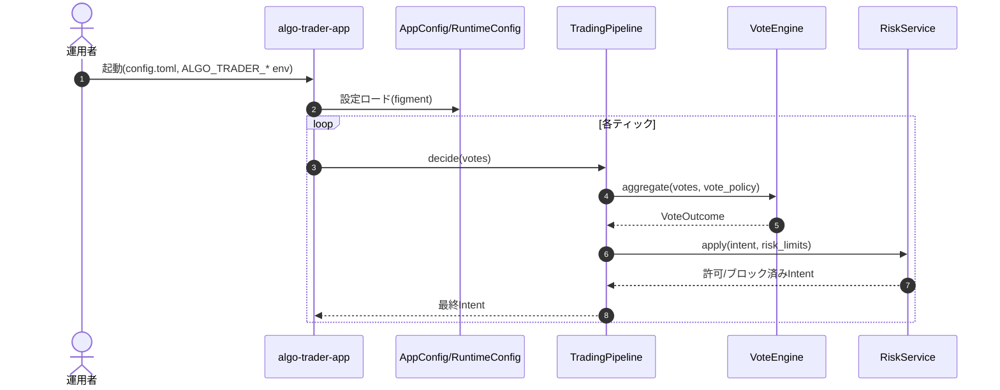
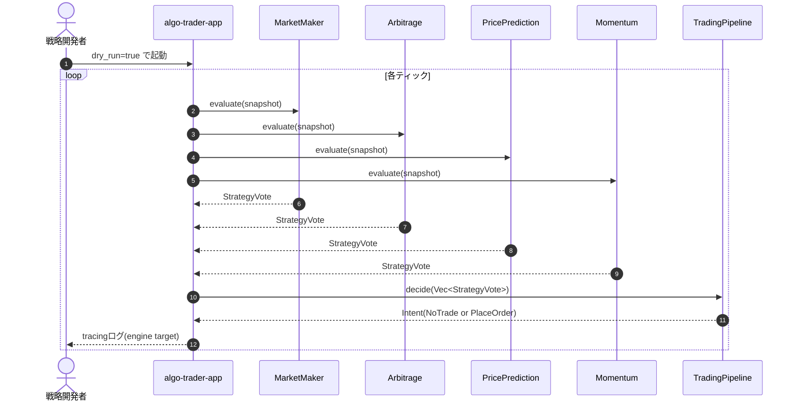
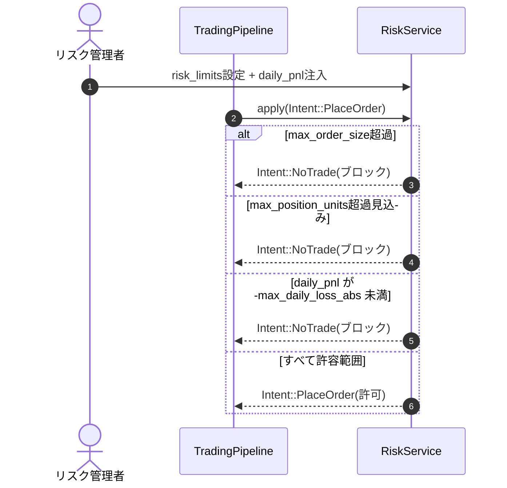
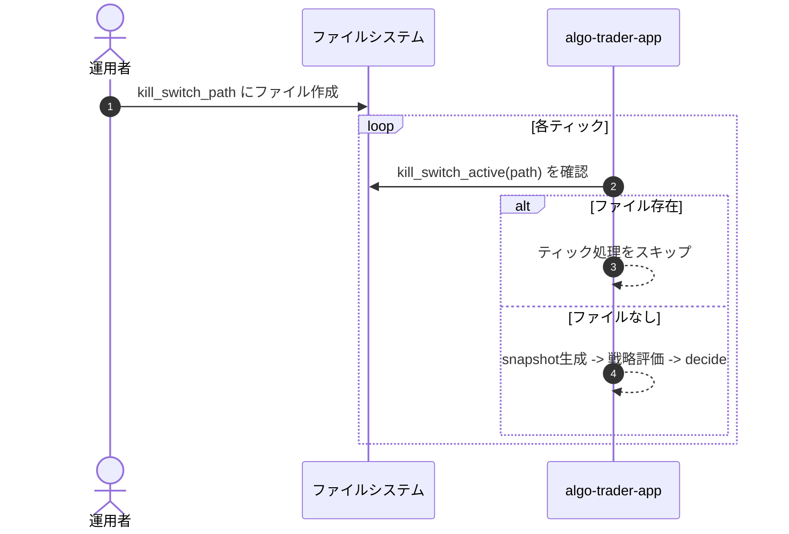
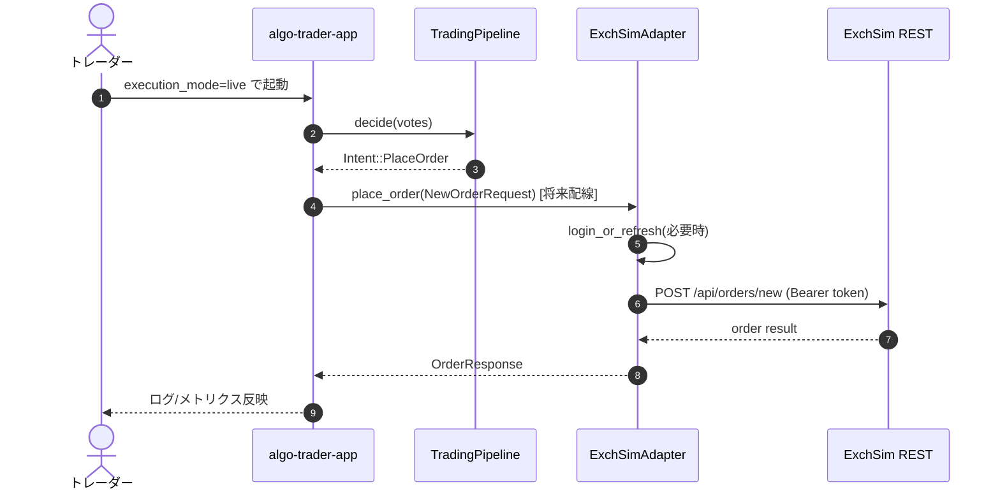
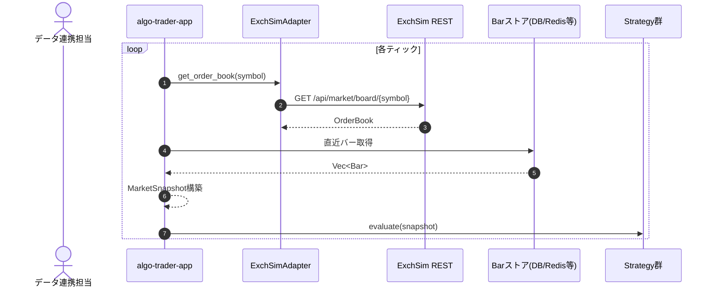

# ユーザーストーリーとシーケンス図（現状ベース）

このドキュメントは、現状の仕様（`engine-core` / `app` / `adapter-exchsim`）から導けるユーザーストーリーを整理したものです。  
実装済み機能と、仕様上の拡張ポイントの両方を含みます。

## 1. 運用者として、設定で投票ポリシーとリスク閾値を切り替えたい

**ユーザーストーリー**  
運用者として、`config.toml` と環境変数で投票ポリシー（weighted/quorum/simple）やリスク閾値を切り替え、再ビルドなしで戦略判断とリスク制約を調整したい。  
これにより、相場状況に合わせて運用ルールを迅速に変更できる。

## 2. 戦略開発者として、ドライランで意思決定ログを検証したい

**ユーザーストーリー**  
戦略開発者として、`dry_run` モードで戦略投票から最終 `Intent` までの流れを観測し、実注文なしでロジックの妥当性を確認したい。  
これにより、本番投入前に安全に閾値や重みをチューニングできる。

## 3. リスク管理者として、危険な注文を自動ブロックしたい

**ユーザーストーリー**  
リスク管理者として、注文サイズ上限・ポジション上限・日次損失上限を超える注文を自動でブロックしたい。  
これにより、戦略が強いシグナルを出しても損失拡大を抑制できる。

## 4. 運用者として、キルスイッチで新規ティック処理を即停止したい

**ユーザーストーリー**  
運用者として、障害時にキルスイッチ用ファイルを置くだけで新規ティック処理を停止したい。  
これにより、プロセス停止より安全かつ迅速に取引判断を止められる。

## 5. トレーダーとして、Live時に取引所アダプタ経由で注文を送信したい（拡張）

**ユーザーストーリー**  
トレーダーとして、`execution_mode=live` のとき `Intent::PlaceOrder` が ExchSim API に送信され、約定ライフサイクルを管理できるようにしたい。  
これにより、検証済み戦略を実運用に接続できる。  
※ 現状 `app` では live 時の実送信は未配線（ログのみ）。

## 6. データ連携担当として、スタブsnapshotを実市場データに置き換えたい（拡張）

**ユーザーストーリー**  
データ連携担当として、`sample_snapshot` を `Exchange::get_order_book` と外部バー取得へ置き換え、実市場に近い `MarketSnapshot` で戦略を評価したい。  
これにより、バックテストと本番判断の乖離を小さくできる。

## 補足（優先度の目安）

- まずは **1〜4** が現行実装に最も近い運用ストーリー。
- **5, 6** は仕様で明示されている拡張ポイントに基づく次フェーズ候補。
